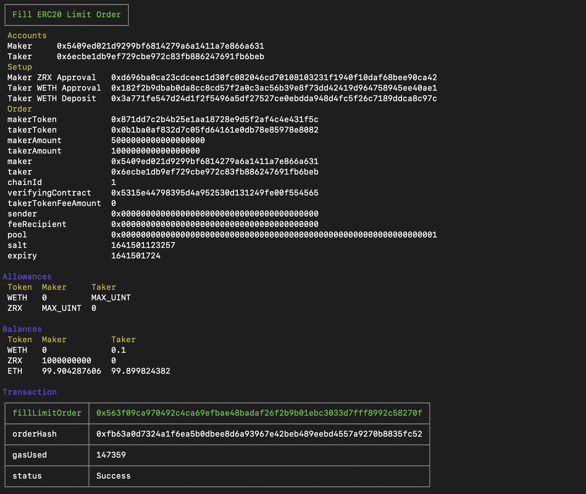

# 0x Starter Project

[](https://circleci.com/gh/0xProject/0x-starter-project)



This project will take you through a number of scenarios using the 0x v4 protocol.

## Scenarios

This repository contains a bunch of scenarios that you can run from the command-line:

-   [Fill a 0x API quote](./src/scenarios/fill_0x_api_swap.ts)
-   [Fill ERC20 limit order](./src/scenarios/fill_erc20_limit_order.ts)
-   [Cancel pair limit orders](./src/scenarios/cancel_pair_limit_orders.ts)
-   [Fill ERC20 RFQ order](./src/scenarios/fill_erc20_rfq_order.ts)
-   [Fill ERC20 RFQ order with a maker order signer](./src/scenarios/fill_erc20_rfq_order_with_maker_order_signer.ts)
-   [Subscribe to RFQ order fill events](./src/scenarios/fill_erc20_limit_order.ts)
-   [Execute Metatransaction](src/scenarios/execute_metatransaction_fill_rfq_order.ts)
-   [Fill ERC20 OTC order](./src/scenarios/fill_erc20_otc_order.ts)
-   [Fill taker-signed ERC20 OTC order](./src/scenarios/fill_taker_signed_erc20_otc_order.ts)
-   [(Advanced) Fill an aggregated quote via TransformERC20](./src/scenarios/transform_erc20.ts)
-   [Create a staking pool](./src/scenarios/create_staking_pool.ts)

## Getting Started

By default this project uses the 0x development mnemonic running against Ganache. This project can be configured to use a different mnenonic and also run against Kovan testnet.

You may choose to update the mnemonic in `src/configs.ts` or use the one provided (note if many people use this mnemonic on Ropsten then the funds may be drained).

When changing the mnemonic ensure that the first three derived address have test ETH. You can request test ETH from https://faucet.paradigm.xyz/. The first derived address will also need test ZRX, which you can mint by running `yarn mint_test_zrx`.

Install dependencies:

```
yarn install
```

Build this package:

```
yarn build
```

Run a scenario in another terminal:

```
yarn scenario:fill_erc20_limit_order
```

To run all scenarios:

```
yarn scenario:all
```

All the scenarios commands can be found in the `package.json`'s `scripts` section and begin with `scenario:`.

### Switching to Ropsten

To switch between Ropsten/ganache, change the last line in `src/configs.ts` and re-build. Ganache is enabled by default.

For Ropsten, you'll also need to provide a value for `ROPSTEN_RPC_URL` in `.env` (copy `.env.example` to create `.env`). You can obtain an API key from [Alchemy](https://www.alchemy.com/).

For Ganache:

```
export const NETWORK_CONFIGS = GANACHE_CONFIGS;
```

For Kovan:

```
export const NETWORK_CONFIGS = ROPSTEN_CONFIGS;
```

### Windows Development Setup

If you're setting up Node.js for the first time on Windows, you may find the following [StackOverflow guide](https://stackoverflow.com/questions/15126050/running-python-on-windows-for-node-js-dependencies/39648550#39648550) useful. There are a few build tools required for Node.js on Windows which are not installed by default (such as Python). Please follow that guide before running through the tutorials.
